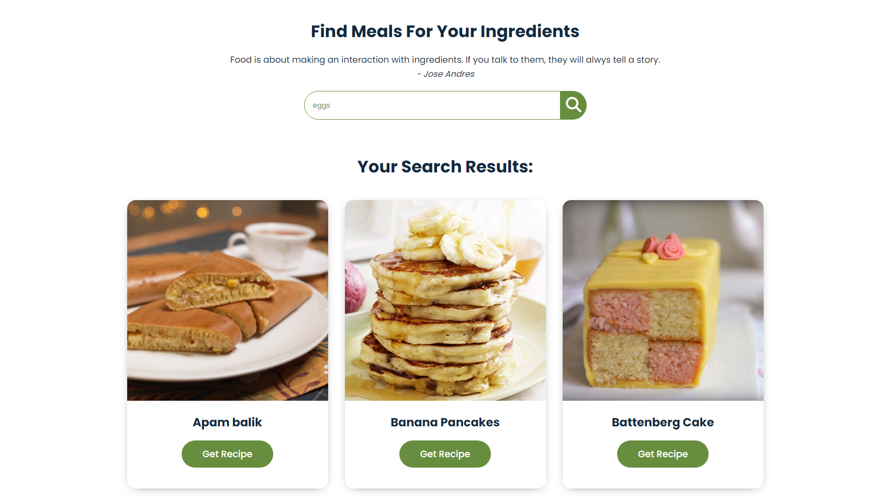

# Food Recipes

I made a wesbite using HTML and CSS to find meals for specific ingredients one might have. I used API from themealdb to generate meal recipes based on an ingredient entered into the search bar. Vanilla Javascript was used to make the API functionanl on the website.

## Sources
https://www.themealdb.com/api.php
